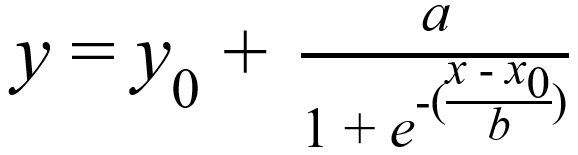

原位酶谱技术：荧光标记的底物与土壤界面的胞外酶反应，释放出的荧光基团被原位保留，并可在355 nm左右的激发光下发射出460 nm左右的可见光。由于酶促反应所降解的荧光标记的底物与所释放的荧光基团在物质的量上相等，而发射光强度与荧光基团释放量有良好的回归关系，故可通过捕捉发射光的强度与分布情况，实现对酶活性的原位高分辨率定量检测。

本文主要介绍土壤原位酶谱图像处理步骤。可配合[演示视频](https://pan.baidu.com/s/1rnmsmLu7UJgau2rjYq6YQw?pwd=m9ir)查看。

# 图像预处理

图像预处理主要包括几何校正、剪裁、灰度修正等。

## 几何校正

由于拍摄角度可能存在偏差，导致图像几何形状失真。首先判断样品图像是否需要进行几何校正，如有必要，可以刻度尺为参照，利用图像处理软件进行几何校正。

以ACDSee软件为例：在编辑状态下打开“透视修正”功能，选择“显示网络线”，拖动外边框直到图内线条与网格线平行或垂直。

-   应注意，几何校正将导致图像信息的失真，因此，建议在拍摄过程中保持相机镜头与膜平行，减少形变发生，以避免几何校正环节。

## 图像剪裁

利用图像处理软件，裁除黑底，只保留膜的影像，并将样品图像剪裁至相同大小，用于后续分析。

以ACDSee软件为例：在编辑状态下打开“旋转”功能，旋转以使膜的边界与网格线平行或垂直；利用“裁剪”功能，框选并保留待分析区域。

## 灰度修正

在成像过程中，可能会因光照、传感器灵敏度以及光学系统等存在不均匀性而引起某些图像偏暗或偏亮。需要对这些图像进行灰度修正，以提高样品间的可比性。

以ImageJ软件为例：

> 打开一张未剪裁的原始图像（如标曲所在的图像）作为基准，用矩形/多边形框选工具选择任意黑底区域，点击Analyze – Measeure（或按M键），测定框选区域的灰度值均值，记录之；

> 以同样方式测定未剪裁的样品图像的黑底灰度值均值（框选区域的大小及位置尽量保持一致）；

> 根据二者灰度值差值，通过加减运算（Process – Math – Add或Subtract）进行灰度修正，使图像间黑底灰度值一致。

-   应注意，灰度修正同样会造成图像信息的失真，因此，建议在拍摄过程中保持成像环境条件、相机参数等完全一致，以避免灰度修正环节。

# 图像伪彩化

图像伪彩化主要包括样品图像上伪彩、颜色校准、添加图例等。

## 图像上伪彩

由于人眼分辨率不同彩色的能力比分辨不同灰度的能力强，因此可以将人眼难以分辨的灰度变化赋以不同的色彩来提高识别率与可比性。

以ImageJ软件为例：

> 打开一系列样品图像，点击Image – Stacks – Images to Stack，层叠，以方便图像切换、进行批量处理等；

> 点击Image – Type – 8-bit，将图像转换为灰度图；

> 点击Image – Lookup Tables，选择适合的伪彩样式（如physics）；

> 点击Image – Adjust – Brightness/Contrast – Auto/Set，或点击Image – Color – Edit LUT，调整伪彩参数，可将样品图像背景灰度值均值或热点阈值（计算步骤见定量分析部分）设为伪彩的最低值，以凸显热点。

## 颜色校准

根据标准样品图像，获取灰度值和活性的对应关系，进而将样品伪彩图的灰度值转换为活性。

### 获取标准样品灰度值

以ImageJ软件为例：

> 打开标准样品图像，利用矩形/多边形工具框选标准样品微孔滤膜；

> 点击Analyze – Measure（或按M键），测定标准样品的灰度值均值；

> 挪动矩形/多边形至另一个标准样品微孔滤膜上，或重选框选区域，点击Analyze – Measure（或按M键），测定灰度值均值；

> 重复框选和测定的操作，记录所有标准样品的灰度值。

### 标准样品灰度值拟合

可在Excel中操作：

> 将标准样品浓度转换为其所代表的活性，活性（nmol cm<sup>-2</sup> h<sup>-1</sup>）= 浓度（mM）× 饱和体积（μL）/ 微孔滤膜面积（cm<sup>2</sup>）/ 反应时间（h）；

> 将标准样品的灰度值和与之对应的活性进行线性拟合，要求*R*<sup>2</sup> \> 0.99。

应注意：

-   标准样品所用的微孔滤膜面积及其饱和溶液体积应自行测定；

-   标准样品的灰度值和浓度/活性之间应呈线性关系，若出现异常，可通过调整相机参数、细化标曲梯度等重新测定、拟合。

### 颜色校准

以ImageJ软件为例：

> 在前述样品伪彩图像的基础上，点击Analyze – Calibrate，弹窗Function选择Straight Line，第一栏输入标准样品灰度值，第二栏输入对应的活性，点击OK，实现样品图像伪彩/灰度值的校准/转换。

## 添加图例

点击Analyze – Tools – Calibrate Bar。

# 定量分析

定量分析主要包括热点（hotspots）分析、根际范围分析等。

## 热点分析

热点分析的步骤可分为样品图像灰度值提取、阈值定义和热点比例计算。

样品图像灰度值提取以ImageJ软件为例：

> 打开一系列样品图像，点击Image – Stacks – Images to Stack，层叠，以方便图像切换、进行整体分析等；

> 点击Analyze – Histogram（或按H键），依次测定每个样品图像以及整体的灰度值，点击弹窗Copy，复制灰度值数据（第一列为灰度值，第二列为特定灰度值的个数/像素点），记录之。

样品图像的灰度值分布通常符合高斯混合模型，可利用EM算法估计高斯混合模型参数，其中占比最大的高斯分布组分被视为背景灰度值。阈值定义为图像背景灰度值的Mean + 2 × SD，灰度值超过阈值的部分被视为热点 (Bilyera et al., 2020)。

热点比例（%）= 大于阈值的灰度值像素点数 / 图像总像素点数 × 100。

可利用R语言normalmixEM函数实现高斯混合模型拟合、进而计算阈值和热点比例等。

``` r
#setwd('D:/R/zymogram') # set current working directory
rm(list=ls()) # clear the environment
cat("\014") # clear the console

# Loading packages
if (!require(pacman)) {install.packages('pacman')}
pacman::p_load(mixtools)

# 导入灰度值数据
Gray <- read.csv('GrayValue.csv', header = FALSE)
Gray <- as.data.frame(lapply(Gray[-c(1, 2), ], as.integer))

# 自定义函数，进行混合高斯模型拟合，并计算阈值、热点比例
process_data <- function(data, col1, col2) {
  if (all(is.na(data[[col1]])) || all(is.na(data[[col2]]))) {
    result_df <- data.frame(
      Proportion_Percent = NA,
      Threshold = NA,
      Comp1_Mean = NA,
      Comp1_SD = NA,
      Comp1_Weight = NA,
      Comp2_Mean = NA,
      Comp2_SD = NA,
      Comp2_Weight = NA
    )
  } else {
    vec <- rep(data[[col1]], times = data[[col2]])
    set.seed(123)
    mod <- normalmixEM(vec)
    
    index_highest_weight <- which.max(mod$lambda)
    mu_background <- mod$mu[index_highest_weight]
    sigma_background <- mod$sigma[index_highest_weight]
    threshold <- mu_background + 2 * sigma_background
    values_above_threshold <- sum(data[[col2]][which(data[[col1]] > threshold)])
    proportion_above_threshold <- values_above_threshold / sum(data[[col2]]) * 100
    
    comp1 <- c(mu = mod$mu[index_highest_weight], sigma = mod$sigma[index_highest_weight], lambda = mod$lambda[index_highest_weight])
    comp2 <- c(mu = mod$mu[-index_highest_weight], sigma = mod$sigma[-index_highest_weight], lambda = mod$lambda[-index_highest_weight])
    
    result_df <- data.frame(
      Proportion_Percent = proportion_above_threshold,
      Threshold = threshold,
      Comp1_Mean = comp1["mu"],
      Comp1_SD = comp1["sigma"],
      Comp1_Weight = comp1["lambda"],
      Comp2_Mean = comp2["mu"],
      Comp2_SD = comp2["sigma"],
      Comp2_Weight = comp2["lambda"]
    )
  }
  return(result_df)
}

combined_df <- data.frame(stringsAsFactors = F)

# 批量计算1:n所有样品的混合高斯分布、阈值和热点比例
for (i in 1:4) {
  col1 <- paste0("V", i*2 - 1)
  col2 <- paste0("V", i*2)
  result_df <- process_data(Gray, col1, col2)
  combined_df <- rbind(combined_df, result_df)
}

rownames(combined_df) <- NULL
write.csv(combined_df, file = "Hotspots.csv", row.names = T, na = "") # 导出结果
```

## 根际范围分析

根际范围分析的步骤可分为样品根际灰度值提取和根际范围定量。

从根中心到周围土壤，存在从高活性/灰度快速降低至相对平稳的低活性/灰度的位置，可将根中心到该位置的距离视为根际范围。

根际范围灰度值提取以ImageJ软件为例：

> 打开样品图像，选取任意单独根系，利用直线工具自根中心向周围土壤画小短线；点击Analyze – Plot Profile（或按K键），显示线段距离像素点及相应的灰度值，点击弹窗Live，拖动或调整短线，找到出现灰度值由相对平稳高值—快速降低—相对平稳低值的合适位置；

> 点击弹窗List，点击Edit – Copy，复制灰度值数据（第一列为距离像素点，第二列为灰度值），记录之。重复此操作，每条清晰的根应至少有15条数据，后续依次分析以计算样品根际范围。

根际范围定量。利用四参数logistic函数，对根中心到非根际的灰度/活性变化进行拟合 (Wei et al., 2022)，方程如下：



其中，*x*<sub>0</sub>表示根际延伸量（根际范围），*y*<sub>0</sub>表示非根际土灰度/活性，*a*表示从非根际到根际土壤灰度/活性的增加量，*b*表示根际梯度的陡度。

记录根际范围*x*<sub>0</sub>（像素点），根据距离与像素点的转换系数（可利用ImageJ软件直线工具测定刻度尺/已知长度线段的像素点获得），将根际范围单位转换为mm。

``` r
#setwd('D:/R/zymogram') # set current working directory
rm(list=ls()) # clear the environment
cat("\014") # clear the console

# 载入函数包
if (!require(pacman)) {install.packages('pacman')}
pacman::p_load(minpack.lm, ggplot2)

# 导入灰度值数据
Gray <- read.csv('PixelGray.csv', header = FALSE)
Gray <- as.data.frame(lapply(Gray[-c(1, 2), ], as.numeric))

# 自定义函数，进行曲线拟合，输出关键参数x0和带拟合线的散点图
process_data <- function(data, col1, col2) {
  plot_list <- list()
  if (all(is.na(data[[col1]])) || all(is.na(data[[col2]]))) {
    x0_result <- data.frame(x0 = NA)
    plot_list[[paste0(i)]] <- list()
  } else {
    x <- unlist(na.omit(Gray[col1]))
    y <- unlist(na.omit(Gray[col2]))
    origin_data <- data.frame(x, y)
    
    # 定义四参数logistic函数用于拟合根际灰度值/活性散点
    sigmoid <- function(x, a, b, x0, y0) {y0 + a / (1 + exp(-(x - x0) / b))}
    fit <- nlsLM(y ~ sigmoid(x, a, b, x0, y0), data = origin_data,
                 start = c(a = 0, b = -1, x0 = 0, y0 = 0), control = nls.lm.control(maxiter = 1000, maxfev = 10000))
    rsquared <- 1 - sum(residuals(fit)^2) / sum((y - mean(y))^2)
    full_model <- nlsLM(y ~ sigmoid(x, a, b, x0, y0), start = coef(fit), control = nls.lm.control(maxiter = 1000, maxfev = 10000))
    p_value_model <- 1 - pchisq((AIC(fit) - AIC(full_model)), df = 1)
    
    fit_a <- coef(fit)["a"]
    fit_b <- coef(fit)["b"]
    fit_x0 <- coef(fit)["x0"]
    fit_y0 <- coef(fit)["y0"]
    if (fit_a < 0) {fit_y0 <- fit_y0 + fit_a}
    if (fit_a < 0) {fit_a <- abs(fit_a)}
    if (fit_b > 0) {fit_b <- -abs(fit_b)}
    if (fit_x0 < 0) {fit <- nlsLM(y ~ sigmoid(x, a, b, x0, y0), data = origin_data,
                                  start = c(a = 0, b = -1, x0 = 0, y0 = 0),
                                  control = nls.lm.control(maxiter = 1000, maxfev = 10000),
                                  lower = c(a = 0, b = -Inf, x0 = 0, y0 = 0),
                                  upper = c(a = 1.1 * (max(y) - min(y)), b = 0, x0 = Inf, y0 = Inf))
    rsquared <- 1 - sum(residuals(fit)^2) / sum((y - mean(y))^2)
    full_model <- nlsLM(y ~ sigmoid(x, a, b, x0, y0), start = coef(fit), control = nls.lm.control(maxiter = 1000, maxfev = 10000),
                        lower = c(a = 0, b = -Inf, x0 = 0, y0 = 0),
                        upper = c(a = 1.1 * (max(y) - min(y)), b = 0, x0 = Inf, y0 = Inf))
    p_value_model <- 1 - pchisq((AIC(fit) - AIC(full_model)), df = 1)
    
    fit_a <- coef(fit)["a"]
    fit_b <- coef(fit)["b"]
    fit_x0 <- coef(fit)["x0"]
    fit_y0 <- coef(fit)["y0"]}
    
    x0_result <- data.frame(x0 = fit_x0) # x0表示根际延伸量（根际范围）
    
    curve_data <- data.frame(x = seq(min(x) - 1 , max(x) + 1, length.out = 100),
                             y = sigmoid(seq(min(x) - 1 , max(x) + 1, length.out = 100), fit_a, fit_b, fit_x0, fit_y0))
    x0_point <- data.frame(x = fit_x0, y = predict(fit, data.frame(x = fit_x0)))
    
    plot_list[[paste0(i)]] <- ggplot(origin_data, aes(x, y)) +
      geom_point() +
      geom_line(data = curve_data, aes(x, y), color = "black") +
      scale_x_continuous(limits = c(min(x) - 1, max(x) + 1), expand = c(0, 0)) +
      scale_y_continuous(limits = c(fit_y0 - 0.1 * fit_a, fit_y0 + fit_a + 0.1 * fit_a), expand = c(0, 0)) +
      geom_text(aes(label = paste("y =", round(fit_y0, 2), "+", round(fit_a, 2), "/(1 + exp(-(x -", round(fit_x0, 2), ")/", round(fit_b, 2), "))"), 
                    x = max(x) + 0.9, y = fit_y0 + fit_a, hjust = 1, vjust = -0.5)) +
      geom_text(aes(label = paste("R² =", round(rsquared, 4), ", P =", round(p_value_model, 4)),
                    x = max(x) + 0.9, y = fit_y0 + fit_a, hjust = 1, vjust = 1)) +
      geom_hline(yintercept = fit_y0, linetype = "dashed", color = "orange") +
      geom_hline(yintercept = fit_y0 + fit_a, linetype = "dashed", color = "blue") +
      geom_point(data = x0_point, aes(x, y), color = "red", size = 3) +
      geom_segment(aes(x = fit_x0, xend = fit_x0, y = fit_y0 - 0.1 * fit_a, yend = predict(fit, x0_point), color = "red")) +
      geom_segment(aes(x = min(x) - 1, xend = fit_x0, y = predict(fit, x0_point), yend = predict(fit, x0_point), color = "red")) +
      labs(title = paste0("Scatter Plot with Fitted Curve", "-p", i), x = "Distance_(pixels)", y = "Gray_Value") +
      theme(legend.position = "none") +
      theme(aspect.ratio = 1) +
      geom_text(aes(label = paste("(", round(fit_x0, 2), ",", round(predict(fit, x0_point), 2), ")"),
                    x = fit_x0, y = predict(fit, x0_point), hjust = 0, vjust = -1), color = "red") +
      geom_text(aes(label = paste("y0 + a =", round(fit_y0 + fit_a, 2)), x = min(x) - 0.9, y = fit_y0 + fit_a, hjust = 0, vjust = -0.5), color = "blue") +
      geom_text(aes(label = paste("y0 =", round(fit_y0, 2)), x = min(x) - 0.9, y = fit_y0, hjust = 0, vjust = -0.5), color = "orange")
  }
  list_x0_plot <- list(x0 = x0_result, plot = plot_list)
  return(list_x0_plot)
}

combined_results <- data.frame(stringsAsFactors = F)
combined_plots <- list()

# 批量运算1:n所有lines的根际范围
for (i in 1:12) {
  col1 <- paste0("V", i*2 - 1)
  col2 <- paste0("V", i*2)
  list_x0_plot <- process_data(Gray, col1, col2)
  combined_results <- rbind(combined_results, list_x0_plot$x0)
  combined_plots <- c(combined_plots, list_x0_plot$plot)
}

rownames(combined_results) <- NULL
write.csv(combined_results, file = "RhizoExtension_Lines.csv", row.names = T, na = "") # 导出所有lines的根际范围

# combined_plots[1]


# 将同一样品的lines的根际范围取平均，以获得样品的根际范围
# 自定义函数，利用四分位距法判定异常值，进而将非异常值取平均
detect_outliers_and_calc_mean <- function(x) {
  q1 <- quantile(x, 0.25, na.rm = T)
  q3 <- quantile(x, 0.75, na.rm = T)
  iqr <- q3 - q1
  lower_bound <- q1 - 1.5 * iqr
  upper_bound <- q3 + 1.5 * iqr
  non_outliers <- x[x >= lower_bound & x <= upper_bound]
  mean_non_outliers <- mean(non_outliers, na.rm = T)
  return(mean_non_outliers)
}

n <- 4 # 规定每n个为一组，批量计算均值
grouped_results <- tapply(combined_results$x0, rep(1:(nrow(combined_results) %/% n), each = n), detect_outliers_and_calc_mean)
grouped_results <- data.frame(x0 = grouped_results)
write.csv(grouped_results, file = "RhizoExtension_Samples.csv", row.names = T, na = "") # 导出所有样品的根际范围
```

# 参考文献

> 魏晓梦, 魏亮, 郝存抗, 祝贞科, 吴金水, 葛体达, 2021. 原位酶谱法高分辨率实时检测土壤微界面酶活分布. 微生物组实验手册 Bio-101, e2003833.

> Bilyera, N., Kuzyakova, I., Guber, A., Razavi, B.S., Kuzyakov, Y., 2020. How "hot" are hotspots: Statistically localizing the high-activity areas on soil and rhizosphere images. Rhizosphere 16, 100259. <https://doi.org/10.1016/j.rhisph.2020.100259>.

> Wei, L., Zhu, Z.K., Razavi, B.S., Xiao, M.L., Dorodnikov, M., Fan, L.C., Yuan, H.Z., Yurtaev, A., Luo, Y., Cheng, W.G., Kuzyakov, Y., Wu, J.S., Ge, T.D., 2022. Visualization and quantification of carbon "rusty sink" by rice root iron plaque: Mechanisms, functions, and global implications. Glob. Change Biol. 28, 6711–6727. <https://doi.org/10.1111/gcb.16372>.
